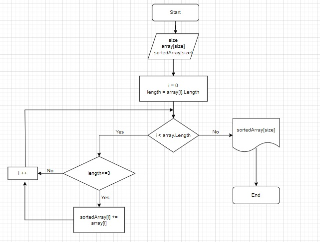

# **ЗАДАЧА. Написать программу, которая из имеющегося массива строк формирует массив из строк,длина которых меньше либо равна 3 символа.**

## *Описание решения задачи:*

## ***1. Создаем метод для формирования первоночального массива.*** 
### Мой  вариант решения задачи предпологает ввод массива пользователем с клавиатуры. Для этого пользователю предлагается ввести размер массива и его первоначальные элементы. 

## ***2. Создаем метод для вывода массива на экран.*** 
### Через цикл for, путем перебора индекса i, выводим заданный массив на экран.

## ***3. Создаем метод для сортировки нашего массива согласно поставленным условиям задачи.*** 
### _ Создаем новый массив sortedArray, выделяем под него место;
### _ Задаем цикл for, перебираем индекс i до тех пор, пока он не вышел за пределы нашего массива;
### _ Ввводим новую переменную length, которая равна длине каждой переменной массива;
### _ Проверяем условие, если переменная length меньше или равна 3 символам, мы добавляем значени массива под индексом i в новый массив, иначе - не добавляем.

## ***4. Выводим на экран изначальный и отсортированный массив.*** 

Блок-схема к основному методу решения задачи: 

